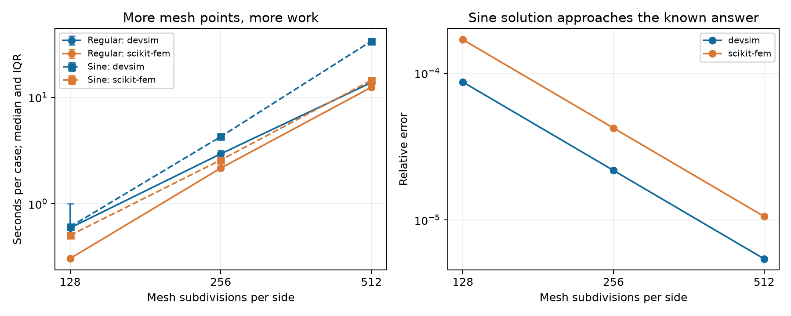

# Two-case Poisson baseline

Two cases, unchanged equations, finer meshes. Both tools passed the analytical checks.

Regular: the silicon–oxide capacitor, with its known straight-line voltage in each layer. Sine: u = sin(pi*x) sin(pi*y), a smooth field that varies in both directions.

| Case | Tool | N=128 | N=256 | N=512 |
|---|---|---|---|---|
| Regular | devsim | 0.59 s | 2.94 s | 13.75 s |
| Regular | scikit-fem | 0.31 s | 2.16 s | 12.42 s |
| Sine | devsim | 0.61 s | 4.27 s | 33.66 s |
| Sine | scikit-fem | 0.51 s | 2.58 s | 14.42 s |

Median of 5 measured runs per size, after an excluded warm-up. Includes mesh setup, solving and saving the same 512 × 512 output. No batch tests.

**Accuracy:** The regular case stays near rounding accuracy. Sine error falls about fourfold when subdivisions double. Error is checked on the actual mesh, outside the timer.

**Your computer:** Intel(R) Core(TM) Ultra 9 285H; 16 physical / 16 logical cores reported; 31.6 GiB total usable RAM; Windows-11-10.0.26200-SP0; CPU only, one compute thread; GPU not used.

[Code explained](../../../CODE_MAP.md) · [Raw results](../raw_results.csv)
